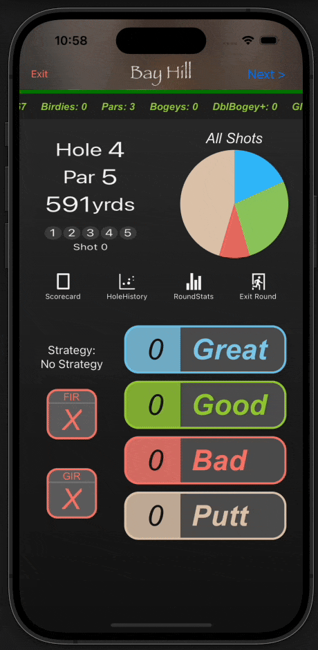
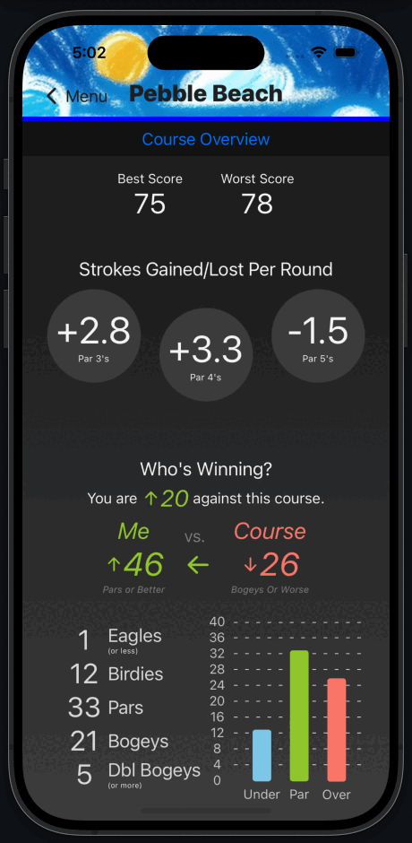
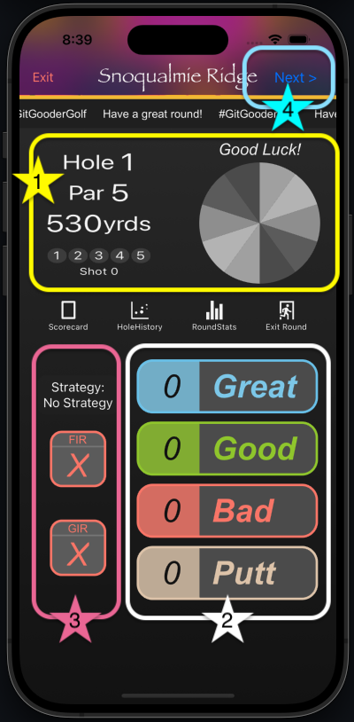

# Golf Gooder ⛳️

# Try it out today on ios using TestFlight https://testflight.apple.com/join/cg5J7JKh

Golf Gooder is a comprehensive golf tracking application designed to help golfers analyze and improve their game. Available on both iOS and Android, this app provides advanced statistics, a dynamic scorecard, and strategic insights tailored to your home course and playing style.

 <!-- Add a banner image of your app here -->

## Features

### 📊 Advanced Statistical Analysis
- **Course & Hole Specific Stats:** Track your performance over time with detailed metrics for each round.
- **Shot Accuracy & Distance:** Measure and analyze shot accuracy and distance to optimize your game.

### 📝 Dynamic Scorecard
- **Real-time Data Recording:** Record each shot as you play, with immediate feedback and visualizations.
- **Customizable Layout:** A scorecard that adapts to your needs, providing a streamlined and intuitive experience.

### 🎯 Strategic Decision-Making
- **Smart Caddy:** Get tailored advice for key decisions on the course, helping you lower your scores.
- **Performance Insights:** Understand your strengths and areas for improvement with easy-to-read graphs and summaries.

 <!-- Add a screenshot of the app in use -->
 <!-- Add another relevant screenshot -->


## 🏌️ How to Track Your Score



1. ** Hole Information**  
     
   All relevant information for the current hole is displayed here, including the hole number, par, yardage, and shot number.

2. ** Shot Categorization**  
     
   After taking your shot, you can categorize it as either:
   - **Great**
   - **Good**
   - **Bad**
   - **Putt**

   These categories are subjective and based on how you felt about the shot, considering factors like contact, outcome, or stress level.

3. **  Fairway in Regulation (FIR) and Green in Regulation (GIR) Tracking**  
    
   - If your **tee shot** lands in the fairway, check off the **FIR** box.
   - If your **approach shot** lands on the green, allowing two putts to make par, check the **GIR** box.  
     For a GIR, your ball should be on the green:
     - **Par 3:** First shot
     - **Par 4:** Second shot
     - **Par 5:** Third shot

4. **  Next Hole Button**  
    
   Tap the **Next** button in the top right corner to advance to the next hole.  
   ⚠️ **Note:** Once you proceed to the next hole, you cannot go back and change your score. Make sure it's correct before moving on.


License Agreement

1. Usage: You may not use, copy, modify, or distribute this code in any form without the explicit permission of the author.
2. Distribution: You may not distribute this code or any derivative works based on it.
3. Modification: You may not modify this code or use it to create derivative works.
4. No Warranty: This code is provided "as-is" without any warranties or guarantees.


## Get started

1. Install dependencies

   ```bash
   npm install
   ```

2. Start the app

   ```bash
    npx expo start
   ```

