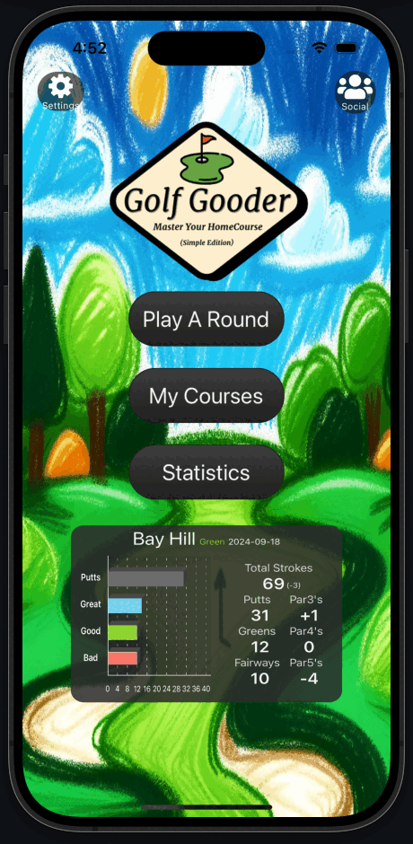

# Golf Gooder ⛳️

Golf Gooder is a comprehensive golf tracking application designed to help golfers analyze and improve their game. Available on both iOS and Android, this app provides advanced statistics, a dynamic scorecard, and strategic insights tailored to your home course and playing style.

 <!-- Add a banner image of your app here -->

## Features

### 📊 Advanced Statistical Analysis
- **Course & Hole Specific Stats:** Track your performance over time with detailed metrics for each round.
- **Shot Accuracy & Distance:** Measure and analyze shot accuracy and distance to optimize your game.

### 📝 Dynamic Scorecard
- **Real-time Data Recording:** Record each shot as you play, with immediate feedback and visualizations.
- **Customizable Layout:** A scorecard that adapts to your needs, providing a streamlined and intuitive experience.

### 🎯 Strategic Decision-Making
- **Smart Caddy:** Get tailored advice for key decisions on the course, helping you lower your scores.
- **Performance Insights:** Understand your strengths and areas for improvement with easy-to-read graphs and summaries.

 <!-- Add a screenshot of the app in use -->
 <!-- Add another relevant screenshot -->


License Agreement

1. Usage: You may not use, copy, modify, or distribute this code in any form without the explicit permission of the author.
2. Distribution: You may not distribute this code or any derivative works based on it.
3. Modification: You may not modify this code or use it to create derivative works.
4. No Warranty: This code is provided "as-is" without any warranties or guarantees.


## Get started

1. Install dependencies

   ```bash
   npm install
   ```

2. Start the app

   ```bash
    npx expo start
   ```

